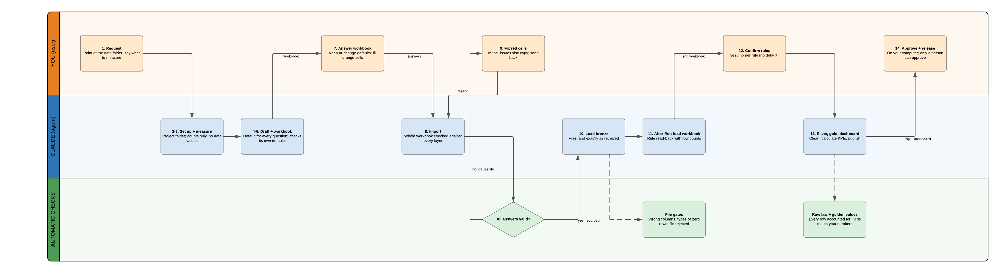

# Building a data warehouse with the dwh skills

A plain-language guide for everyone involved — no coding needed. The illustrated version (with the
Lucid diagram) is the Claude doc
[“Building a data warehouse with the dwh skills — complete guide”](https://claude.ai/code/artifact/0c1af660-de3f-4a1b-82c7-03b48e9480df).



## What this is

You give Claude your data files and say what you want to see. Claude asks every question in one
Excel workbook, you answer it, and Claude builds a checked warehouse and a dashboard. **Claude
drafts and runs; people decide.** A computer check — not Claude's opinion — decides whether each
step may run.

| Skill | What it does |
|---|---|
| dwh-init | sets up the pipeline, measures the data (counts only), writes the question workbook, reads the answers back |
| dwh-bronze | loads the files exactly as received; a file breaking the agreed layout is rejected whole |
| dwh-silver | cleans: types, duplicates, impossible rows (set aside with a reason), empty values, privacy (hashing) |
| dwh-gold | calculates the KPIs from the definitions you approved and checks them against numbers you worked out by hand |
| dwh-serve | publishes the numbers and runs the dashboard |
| dwh-synthetic-source | makes fake test data when real files are not available yet (optional) |

## Before you start

| # | You need | Why |
|---|---|---|
| 1 | The dwh skills installed in Claude (from this repo's releases) | Without them nothing is gated |
| 2 | Data as files: CSV, Parquet, JSON or Excel, with a header row | Files only (no live databases yet) |
| 3 | A batch number or date in each file or folder name (`batch_01/`, `sales_2024-01.csv`) | That is how later deliveries are recognised |
| 4 | Any documentation (data dictionary, README, known issues) | Claude turns it into better default answers |
| 5 | A rough idea of what to measure | KPIs are proposed from your request |
| 6 | Named people for four roles (can all be you): DE data engineer, PO product owner, SME business-rule owner, GOV governance | Only a named person can make owner decisions |
| 7 | Excel or LibreOffice; Python 3.10+ to run it yourself later | You answer in a workbook; the pipeline runs locally |

## Where it starts: a new pipeline in this repository

```bash
python tools/new_pipeline.py sales
```

Write what you want in `pipelines/sales/requirements/request.md`, put the files in
`pipelines/sales/data/raw/` (never committed) and tell Claude: *"Set up the warehouse for
pipelines/sales — use batch 1 only for now."*

## The life cycle, step by step

You act in steps 1, 7, 9, 12 and 14; Claude does the rest and stops whenever it needs you.

| # | Step | Who | What happens | What you get or do |
|---|---|---|---|---|
| 1 | Request | You | Point Claude at the pipeline, say what you want and which data to use | A chat message |
| 2 | Set up | Claude | Pins the shared kernel, checks the environment | — |
| 3 | Measure the data | Claude | Finds the sources and counts rows, empty values, formats, candidate keys. Counts only — no data values | — |
| 4 | Read the requirements | Claude | Reads `requirements/`, writes a draft answer for every question with a one-line reason (`intake/draft.yaml`) | — |
| 5 | Write the workbook | Claude | One Excel file, every question of every layer, each answer pre-filled | — |
| 6 | Check its own defaults | Claude | Runs the import's checks on the pre-filled answers and fixes its own mistakes | — |
| 7 | Answer the workbook | You | Keep or change each answer, fill the orange cells, save, say "done" | the workbook |
| 8 | Import | Claude | Checks everything against every layer. Anything wrong: nothing is recorded and you get an `-issues.xlsx` copy with red cells. Clean: every answer is recorded in the name of the person who gave it | issues file, or a summary |
| 9 | Fix issues (only if any) | You | Correct the red cells, save, say "done" | — |
| 10 | Load bronze | Claude | Loads the files as received | — |
| 11 | After-first-load questions | Claude | Ambiguous dates, the rule read-back (each rule with how many rows it matches), always-empty columns | a short second workbook |
| 12 | Confirm the rules | You | Look at the counts; type yes or no per rule | — |
| 13 | Build silver, gold, dashboard | Claude | Cleans, calculates, checks every number (counts add up, golden values match), publishes, screenshots | dashboard screenshot; a pull request with the specs, answers, workbooks and reports |
| 14 | Approve and release | You | In your own terminal: `./dwh approve --by <you>`, then `./dwh publish --target consumers`. Claude cannot do this | the released dashboard |

## The intake workbook

Colours: **blue on yellow** = a default you may keep or type over · **orange** = required, no
default · **grey** = information (counts, never values) · **★** = an owner decision; keeping its
default records it as that owner's own answer. Special words: `NA` (not applicable, optional
answers only), `none` (there are none), `pending` (the owner decides later, where offered).

| Tab | Owner | One row per | What you fill |
|---|---|---|---|
| Start here | — | — | instructions and counts |
| People | DE | person | id, name, email, roles |
| Project | DE | question | name; profile (`fast` / `governed` / `demo`); builder; who answered each role |
| Governance ★ | GOV | question | compliance; what Claude may see (`stats_only` …); row security |
| Reporting policy ★ | PO | question | time zone, calendar, week start, money decimals |
| Sources | DE | data feed | location (with `{batch}`), format, load type, re-delivery, new columns, freshness, row limits |
| Schema | DE | column | type, required, key, allowed values — never NA |
| Classification ★ | GOV | column | public / internal / pii / sensitive / regulated; hash, drop or keep |
| Silver model | DE | column | entity, clean name, formula, type, date formats, or why it is left out |
| Entities | DE · SME · PO | cleaned table | key, which duplicate wins, merge strategy, max % rejected |
| Data quality | SME | check | impossible rows (rejected with a reason); real-but-odd rows (kept ★); empty values; never-filled columns ★ |
| Lookups & flags | DE · SME | lookup / flag | columns brought in from another table; yes/no flags |
| KPIs ★ | PO | KPI (a column each) | meaning, type, what is counted, filters, denominator, grouping, grain, unit, range, dispute owner |
| Golden values ★ | PO | checked number | ≥ 3 numbers per KPI worked out by hand — no default on purpose |
| Dashboard / visuals | PO | question / tile | title, audience, clock, filters; tiles and charts |
| After first load ★ | SME | question | second round only: dates, rule read-back (no default on purpose), empty columns |

## The checks that protect you

| Check | Stops |
|---|---|
| Gates | building a layer before all its answers exist |
| All-or-nothing import | half a workbook being recorded |
| Owner check | an owner decision recorded by the wrong person, or by Claude |
| File gates (bronze) | a file with missing/unexpected columns, changed types or zero rows |
| Row law (silver) | rows disappearing silently: rows in = kept + rejected (with reason) + duplicates |
| Rule read-back | a rule that is valid but means something else |
| Golden values (gold) | a KPI formula that runs but is wrong |
| Reconciliation (gold) | rows lost between silver and the KPIs |
| Release gate | unchecked numbers shown to others |
| Kernel pin | a pipeline silently built by a different kernel version |
| CI (this repo) | hand-edited generated code; data or secrets committed; a broken pipeline folder |

## Issues and limits

- Save the workbook over the file Claude sent, in the same folder, before saying "done".
- Never edit the header row or the Question ID column; add rows below.
- Keeping every default unread makes every ★ decision yours — read Governance, Classification,
  Data quality and KPIs at least. `./dwh status` lists the ★ defaults you kept.
- Raw data and the warehouse are not in git. Keep `.dwh/salt` backed up (see the runbooks).
- Not yet supported: row-level security, releasing regulated data (GDPR/HIPAA/GxP), fiscal
  calendars, live databases/APIs, SCD2 history tables, custom code steps.

## Commands (run inside the pipeline folder; `dwh.cmd` on Windows)

| Command | Does | Who |
|---|---|---|
| `python tools/doctor.py` (repo root) | checks Python, writes every pipeline's `./dwh` wrapper | once per machine |
| `./dwh intake analyze data/raw` | measures the files, counts only | Claude |
| `./dwh intake workbook` | writes the question workbook and checks its defaults | Claude |
| `./dwh intake import <file>.xlsx` | reads the answers back, all or nothing | Claude |
| `./dwh intake check all` | which layers may build | anyone |
| `./dwh build bronze` / `silver` / `gold` | builds a layer, refusing if its gate fails | Claude |
| `./dwh status` | where everything stands | anyone |
| `./dwh layout show` | where each kind of file lives | anyone |
| `./dwh serve` | dashboard on http://localhost:8501 | you |
| `./dwh approve --by <id>` | your approval of the current answers | **a person only** |
| `./dwh publish --target consumers` | releases the dashboard | you |
